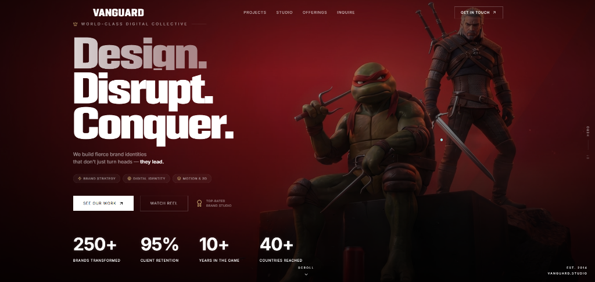

# 🌌 VANGUARD — World-Class Digital Collective

> **Design. Disrupt. Conquer.**
> A premium, modern React + Vite + Tailwind CSS portfolio for **VANGUARD Studio**. It features a dark cinematic aesthetic, high-contrast gold accents, fluid micro-animations, custom range inputs, and interactive case study panels.

---

## 🎬 Showcase



---

## 🚀 Key Features

* **Custom Range Input Slider:** An interactive, modern estimated budget slider designed with a sleek gold-accented thumb (`#C8A96E`), scaling transitions, and a dynamic progress-fill gradient.
* **Minimalist Custom Cursor:** A sleek, minimal cursor dot tracking mouse coordinates smoothly across the viewport.
* **Cinematic Showreel Popup:** A fully responsive overlay modal playing the studio's cinematic showreel video with audio toggles.
* **Interactive Project Case Studies:** Immersive modal panels showing stylized glitch-art project summaries (AETHER, KINETIC, NEURAL, KRONOS) with details on challenges, solutions, and deliverables.
* **Custom Favicon:** Designed with a sharp geometric golden `V` monogram SVG logo.
* **Modern Web Standards:** Fluid accordion layouts, glassmorphic cards, custom utility animations, and a responsive mobile drawer navigation menu.

---

## 🛠️ Tech Stack

* **Core:** [React 18](https://react.dev/), [TypeScript](https://www.typescriptlang.org/)
* **Build System:** [Vite 6](https://vite.dev/)
* **Styling:** [Tailwind CSS 3](https://tailwindcss.com/) & Vanilla CSS variables
* **Icons:** [Lucide React](https://lucide.dev/)

---

## 📦 Getting Started

### 1. Installation
Clone the repository and install the project dependencies:
```bash
git clone https://github.com/CryptGodSon/Vanguard-Studio.git
cd Vanguard-Studio
npm install
```

### 2. Run Locally (Development Server)
To start the local Vite development server:
```bash
npm run dev
```

If you are running other projects in the background and want to spin up this app on a custom port (e.g. `8080`):
```bash
npm run dev -- --port 8080
```

### 3. Production Build
To run a type-safety check and compile the production bundle:
```bash
npm run build
```

---

## 👨‍💻 Author

**CryptGodSon**
* GitHub: [@CryptGodSon](https://github.com/CryptGodSon)

<!-- Place this tag where you want the button to render. -->
<a class="github-button" href="https://github.com/CryptGodSon" data-color-scheme="no-preference: light; light: light; dark: dark;" data-size="large" aria-label="Follow @CryptGodSon on GitHub">Follow @CryptGodSon</a>

<!-- Place this tag in your head or just before your close body tag. -->
<script async defer src="https://buttons.github.io/buttons.js"></script>
